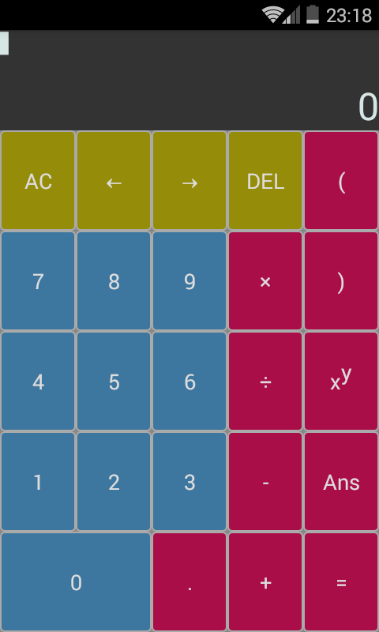
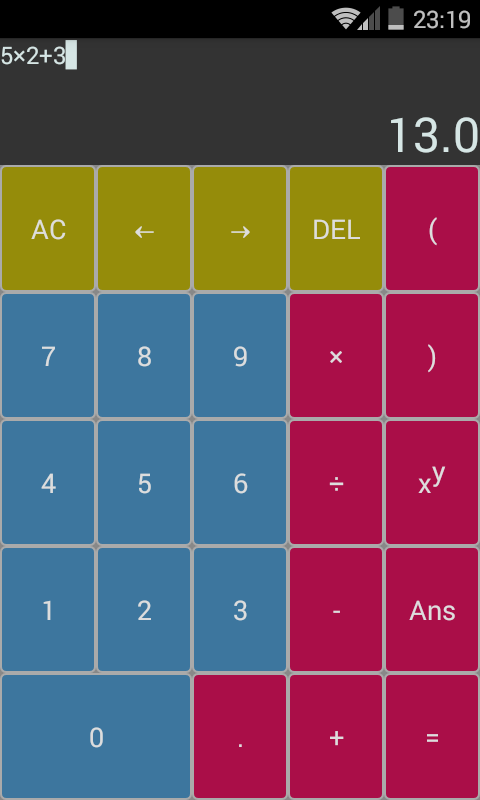
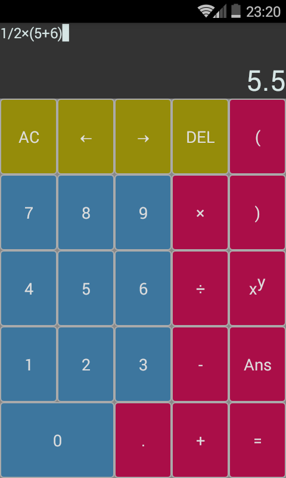
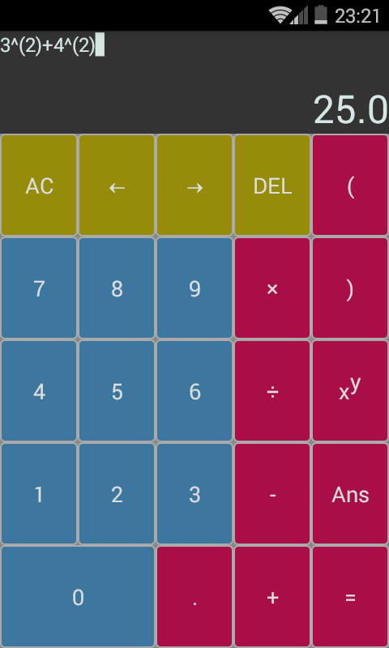
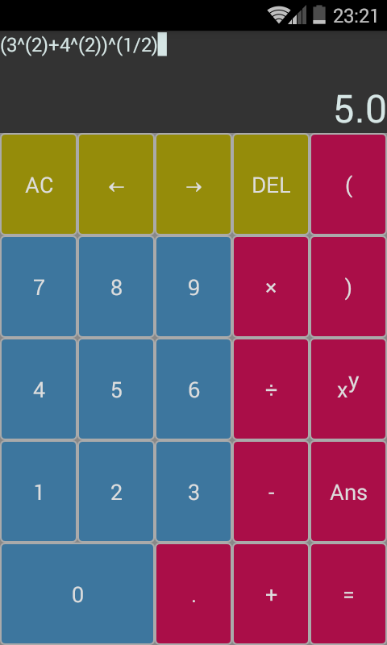

# Android Simple Calculator

## Screenshots

## Changelog

v1.0

- built calculator prototype

v1.0.1

- fixed flash effect synchronization problem

v1.1

- provided generic solution for solving equation display text overflow problem
